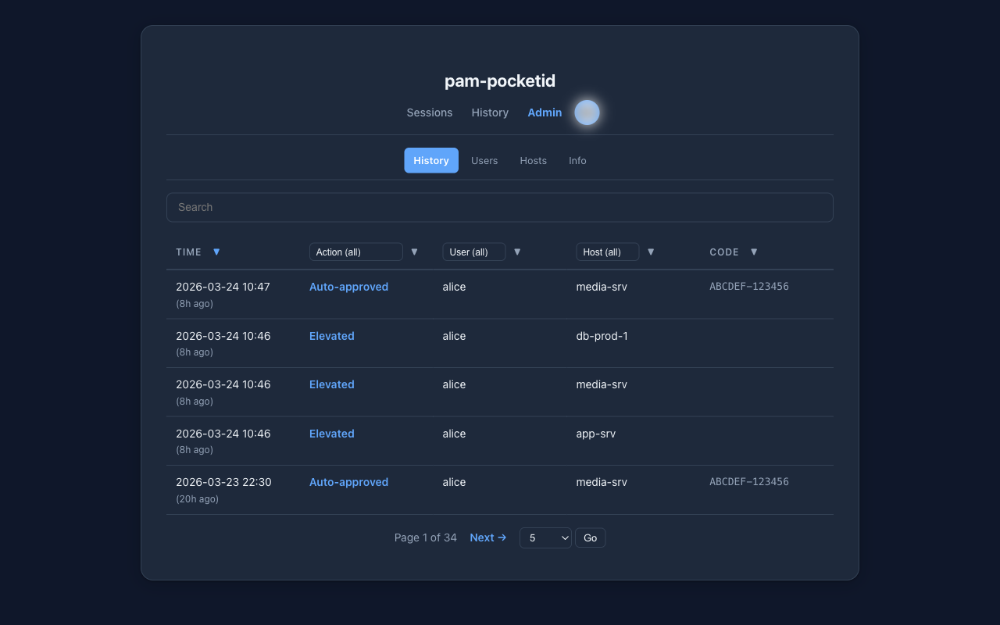
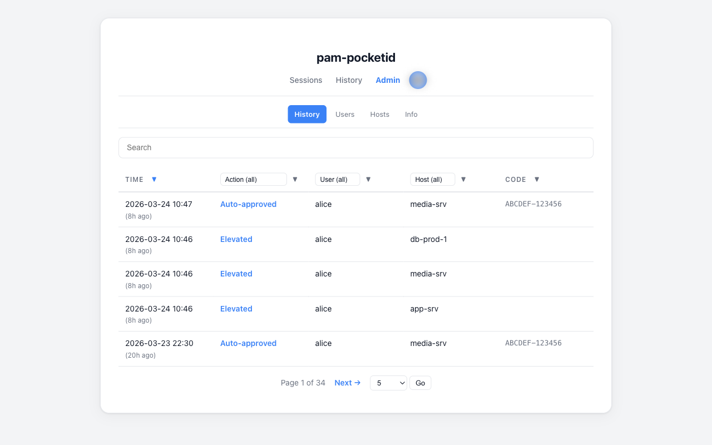
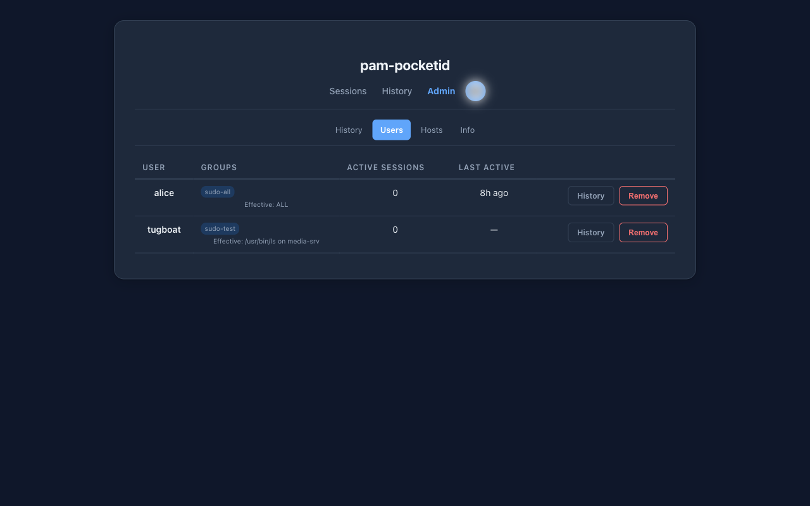
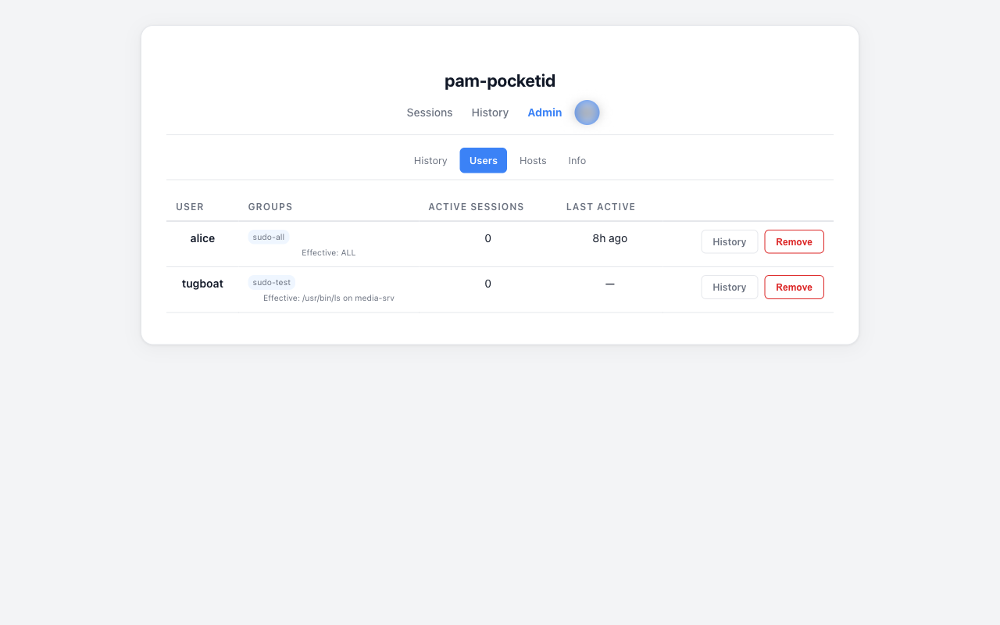
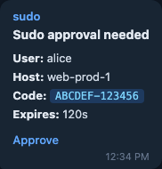

# pam-pocketid

Browser-based sudo elevation via [Pocket ID](https://github.com/pocket-id/pocket-id). When a user runs `sudo`, they're shown a URL and code — authenticate with a passkey in the browser, and sudo proceeds. No passwords required.

> **Note:** The majority of this project's code was generated using AI-powered coding tools, with human direction, design decisions, and review throughout. All features have been extensively tested by hand against real infrastructure.

## How it works

```
 Terminal                    pam-pocketid server             Pocket ID
    |                               |                            |
    | ---- POST /challenge -------> |                            |
    |      {user: jordan}           |                            |
    |                               |                            |
    | <----- url + code ----------- |                            |
    |                               |                            |
    | "Approve at:                  |                            |
    |  sudo.example.com/            |                            |
    |  approve/ABCDEF-123456"       |                            |
    |                               |                            |
    |    User opens URL ----------> | Approval page              |
    |                               |                            |
    |                               | ---- OIDC auth code -----> |
    |                               |                            |
    |                               |              Passkey login |
    |                               |                            |
    |                               | <--- callback (id_token) - |
    |                               |                            |
    |                               | Verify: username matches   |
    |                               | Challenge approved         |
    |                               |                            |
    | <---- poll: approved -------- |                            |
    |                               |                            |
    sudo proceeds                   |                            |
```

Two components:
1. **Server** (`pam-pocketid serve`) — OIDC relay that manages challenges and handles browser auth
2. **PAM helper** (`pam-pocketid`) — called by `pam_exec`, creates challenge, shows URL, polls for approval

## Features

- Passkey-based sudo approval via browser — no passwords in the auth chain
- **Break-glass fallback** — bcrypt-based local password when the server is unreachable; exponential backoff after failed attempts
- **Grace periods** — skip re-auth per-host within a configurable window (not rolling, not cross-host)
- **Token cache** — cache OIDC ID tokens locally for instant repeat approvals within the token lifetime
- **Push notifications** — run any shell command when a challenge is created; per-user routing via JSON mapping file
- **Break-glass escrow** — send plaintext password to any external secrets manager via shell command (1Password, Vault, AWS Secrets Manager, etc.)
- **Host registry** — per-host shared secrets; only registered hosts can create challenges, with per-host user allow-lists
- **Web dashboard** — approve/reject challenges, manage grace sessions, view history, manage hosts; real-time updates via SSE
- **Admin access** — members of configured OIDC groups can manage all users' challenges
- **One-tap approval** — notification links approve the challenge immediately if the OIDC session is fresh
- **Prometheus metrics** — `/metrics` exposes challenge, grace session, escrow, and notification counters
- **Internationalization** — dashboard translated into 8 languages (en, es, fr, de, ja, zh, pt, ko)
- **Graceful shutdown** — drains in-flight requests, waits for notifications, flushes session state
- **Host groups** — tag hosts with a group label at registration; filter the Hosts tab by group
- **Approval policies** — require a second admin approval for challenges from specific hosts via glob patterns
- **Activity timeline** — 24-hour sparkline on the History tab; click a bar to filter by that hour
- **Webhook notifications** — structured webhook delivery for Discord, Slack, ntfy, Apprise, and custom endpoints
- **API keys for SIEM** — Bearer token auth on `/api/history/export` for log pipeline integration
- **Confirmation dialogs** — all destructive actions (revoke, reject, remove host) prompt before executing

## Quick start

### 1. Register an OIDC app in Pocket ID

Create a new OIDC client in Pocket ID:
- **Redirect URI**: `https://sudo.example.com/callback`
- **Scopes**: `openid`, `profile`, `email`, `groups`

Note the client ID and secret.

### 2. Run the server

```yaml
services:
  pam-pocketid:
    image: ghcr.io/rinseaid/pam-pocketid:latest
    ports:
      - "127.0.0.1:8090:8090"
    environment:
      PAM_POCKETID_ISSUER_URL: "https://id.example.com"
      PAM_POCKETID_CLIENT_ID: "your-oidc-client-id"
      PAM_POCKETID_CLIENT_SECRET: "your-oidc-client-secret"
      PAM_POCKETID_EXTERNAL_URL: "https://sudo.example.com"
      PAM_POCKETID_SHARED_SECRET: "your-shared-secret"
      PAM_POCKETID_SESSION_STATE_FILE: "/data/sessions.json"
    volumes:
      - pam-pocketid-data:/data
    stop_grace_period: 30s
    restart: unless-stopped
    cap_drop:
      - ALL
    security_opt:
      - no-new-privileges:true
    read_only: true

volumes:
  pam-pocketid-data:
```

The Docker image is built on `debian:bookworm-slim` and includes: the `pam-pocketid` binary, Python 3 with `apprise`, the 1Password Python SDK, and `ca-certificates`. The server runs as a non-root user (`pampocketid`). GitHub Actions publishes a fresh `:latest` image to `ghcr.io/rinseaid/pam-pocketid` on every push to `main`.

### 3. Install the PAM helper on Linux hosts

**Quick install** (downloads latest binary and installs a systemd rotation timer):

```bash
curl -fsSL https://raw.githubusercontent.com/rinseaid/pam-pocketid/main/install.sh | sudo bash
```

**Or install manually:**

```bash
curl -L -o /usr/local/bin/pam-pocketid \
  https://github.com/rinseaid/pam-pocketid/releases/latest/download/pam-pocketid-linux-amd64
chmod +x /usr/local/bin/pam-pocketid
```

Configure the helper via `/etc/pam-pocketid.conf` (must be owned by root, mode `0600`):

```bash
cat > /etc/pam-pocketid.conf <<EOF
PAM_POCKETID_SERVER_URL=https://sudo.example.com
PAM_POCKETID_SHARED_SECRET=your-shared-secret
EOF
chmod 600 /etc/pam-pocketid.conf
```

Environment variables take precedence over config file values. The config file is opened with `O_NOFOLLOW`, must be mode `0600`, and must be owned by root — files with group/other permissions or non-root ownership are rejected.

### 4. Configure PAM

Edit `/etc/pam.d/sudo` (and `/etc/pam.d/sudo-i` if it exists):

```
auth    required    pam_exec.so    stdout /usr/local/bin/pam-pocketid

account required    pam_unix.so
session required    pam_limits.so
```

> Do not use `expose_authtok` — that flag causes sudo to prompt for a password before invoking pam-pocketid. No password is needed.

## What the user sees

**Normal approval:**
```
$ sudo apt update

  Sudo requires Pocket ID approval.
  Approve at: https://sudo.example.com/approve/ABCDEF-123456
  Code: ABCDEF-123456
  (A notification has also been sent.)

  Waiting for approval (expires in 120s).....
  Approved!
```

**Break-glass (server unreachable):**
```
$ sudo whoami

  *** BREAK-GLASS AUTHENTICATION ***
  The Pocket ID server is unreachable.
  Enter the break-glass password to proceed.

Break-glass password: ********
  Break-glass authentication successful.

root
```

**Grace period (recent approval on same host):**
```
$ sudo systemctl restart nginx

  Sudo approved (recent authentication).
```

## Configuration reference

### Server environment variables

| Variable | Default | Description |
|---|---|---|
| `PAM_POCKETID_ISSUER_URL` | *(required)* | Pocket ID OIDC issuer URL |
| `PAM_POCKETID_CLIENT_ID` | *(required)* | OIDC client ID |
| `PAM_POCKETID_CLIENT_SECRET` | *(required)* | OIDC client secret |
| `PAM_POCKETID_EXTERNAL_URL` | *(required)* | Public URL of this server |
| `PAM_POCKETID_SHARED_SECRET` | *(required)* | Shared secret for PAM helper auth (min 16 chars) |
| `PAM_POCKETID_LISTEN` | `:8090` | Listen address |
| `PAM_POCKETID_CHALLENGE_TTL` | `120` | Challenge lifetime in seconds (10–600) |
| `PAM_POCKETID_GRACE_PERIOD` | `0` | Skip re-auth per-host within this many seconds (0 = disabled, max 86400) |
| `PAM_POCKETID_ONETAP_MAX_AGE` | `7200` | Max OIDC session age in seconds for one-tap approval without re-login |
| `PAM_POCKETID_SESSION_STATE_FILE` | *(none)* | Path to JSON file for persisting grace sessions and history across restarts |
| `PAM_POCKETID_HOST_REGISTRY_FILE` | *(none)* | Path to JSON file for per-host secrets (auto-derived from `SESSION_STATE_FILE` if not set) |
| `PAM_POCKETID_HISTORY_PAGE_SIZE` | `5` | Default entries per page on the History tab (valid: 5/10/25/50/100/500/1000) |
| `PAM_POCKETID_ADMIN_GROUPS` | *(empty)* | Comma-separated OIDC group names with admin dashboard access |
| `PAM_POCKETID_ADMIN_APPROVAL_HOSTS` | *(empty)* | Comma-separated glob patterns of hostnames that require a second admin approval before a challenge is granted |
| `PAM_POCKETID_WEBHOOKS` | *(empty)* | JSON array of webhook configurations for structured notifications (see [Webhooks](#webhooks)) |
| `PAM_POCKETID_WEBHOOKS_FILE` | *(empty)* | Path to a JSON file containing the webhook configuration array |
| `PAM_POCKETID_NOTIFY_WEBHOOK_URL` | *(empty)* | (legacy, use WEBHOOKS instead) Single webhook URL for structured notifications |
| `PAM_POCKETID_API_KEYS` | *(empty)* | Comma-separated API keys for Bearer token auth on `/api/history/export` |
| `PAM_POCKETID_POCKETID_API_KEY` | *(empty)* | Pocket ID API key for server-side Pocket ID API calls |
| `PAM_POCKETID_POCKETID_API_URL` | *(empty)* | Pocket ID API base URL for server-side Pocket ID API calls |
| `PAM_POCKETID_NOTIFY_COMMAND` | *(empty)* | Shell command to run when a new challenge is created |
| `PAM_POCKETID_NOTIFY_ENV` | *(empty)* | Comma-separated env var prefixes to pass to the notify command (e.g., `APPRISE_,TELEGRAM_`) |
| `PAM_POCKETID_NOTIFY_USERS_FILE` | *(empty)* | Path to JSON file mapping usernames to per-user notification URLs |
| `PAM_POCKETID_ESCROW_COMMAND` | *(empty)* | Shell command to escrow break-glass passwords (receives plaintext on stdin) |
| `PAM_POCKETID_ESCROW_ENV` | *(empty)* | Comma-separated env var prefixes to pass to the escrow command (e.g., `AWS_,VAULT_,OP_`) |
| `PAM_POCKETID_ESCROW_LINK_TEMPLATE` | *(empty)* | URL template for viewing escrowed credentials (`{hostname}` and `{item_id}` placeholders) |
| `PAM_POCKETID_ESCROW_LINK_LABEL` | `View password` | Label for escrow link button on the Hosts tab |
| `PAM_POCKETID_BREAKGLASS_ROTATE_BEFORE` | *(empty)* | RFC3339 timestamp; clients with hash files older than this will rotate on next sudo |
| `PAM_POCKETID_CLIENT_BREAKGLASS_PASSWORD_TYPE` | *(none)* | Server-side override: client break-glass password type (`random`/`passphrase`/`alphanumeric`) |
| `PAM_POCKETID_CLIENT_BREAKGLASS_ROTATION_DAYS` | *(none)* | Server-side override: client break-glass rotation interval (days) |
| `PAM_POCKETID_CLIENT_TOKEN_CACHE` | *(none)* | Server-side override: client token cache (`true`/`false`) |
| `PAM_POCKETID_INSECURE` | `false` | Allow unauthenticated API — not for production |

### PAM helper configuration

Set in `/etc/pam-pocketid.conf` or as environment variables (env takes precedence).

| Variable | Default | Description |
|---|---|---|
| `PAM_POCKETID_SERVER_URL` | *(required)* | URL of the pam-pocketid server |
| `PAM_POCKETID_SHARED_SECRET` | *(empty)* | Shared secret (must match server, min 16 chars) |
| `PAM_POCKETID_POLL_MS` | `2000` | Poll interval in milliseconds (500–30000) |
| `PAM_POCKETID_TIMEOUT` | `120` | Max seconds to wait for approval (10–600) |
| `PAM_POCKETID_BREAKGLASS_ENABLED` | `true` | Enable break-glass fallback |
| `PAM_POCKETID_BREAKGLASS_FILE` | `/etc/pam-pocketid-breakglass` | Path to break-glass bcrypt hash file |
| `PAM_POCKETID_BREAKGLASS_ROTATION_DAYS` | `90` | Automatic rotation interval in days (1–3650) |
| `PAM_POCKETID_BREAKGLASS_PASSWORD_TYPE` | `random` | Password type: `random`, `passphrase`, or `alphanumeric` |
| `PAM_POCKETID_TOKEN_CACHE` | `true` | Enable OIDC token caching |
| `PAM_POCKETID_TOKEN_CACHE_DIR` | `/run/pocketid` | Directory for cached tokens |
| `PAM_POCKETID_ISSUER_URL` | *(none)* | OIDC issuer URL for local JWT validation (required to enable token cache) |
| `PAM_POCKETID_CLIENT_ID` | *(none)* | OIDC client ID for audience verification (required to enable token cache) |

## CLI commands

| Command | Description |
|---|---|
| `pam-pocketid` | PAM helper (called by `pam_exec`, not run directly) |
| `pam-pocketid serve` | Run the authentication server |
| `pam-pocketid rotate-breakglass [--force]` | Rotate the break-glass password |
| `pam-pocketid verify-breakglass` | Verify a break-glass password against the stored hash |
| `pam-pocketid add-host <hostname> [--users user1,user2] [--group <group>]` | Register a host with a generated per-host secret; optionally assign to a group |
| `pam-pocketid remove-host <hostname>` | Unregister a host |
| `pam-pocketid list-hosts` | List all registered hosts |
| `pam-pocketid rotate-host-secret <hostname>` | Generate a new secret for a registered host |
| `pam-pocketid --version` | Show version |
| `pam-pocketid --help` | Show usage information |

## Web dashboard

Accessible at `PAM_POCKETID_EXTERNAL_URL`. Login is via Pocket ID OIDC (passkey). Real-time updates are pushed via Server-Sent Events — no polling or manual refresh required. All destructive actions (reject, revoke, remove host) show a confirmation dialog before executing.

### Sessions tab (`/`)

- **Pending challenges** — sorted by urgency; approve or reject individually or in bulk
- **Active grace sessions** — revoke individually or all at once
- **Recent history** — last 5 actions with a link to the full history tab

### History tab (`/history`)

Full audit log with sortable columns, filter dropdowns, live search, configurable pagination (5–1000 entries/page), CSV/JSON export, and timezone-aware timestamps. A 24-hour activity sparkline sits above the log: each bar represents one hour; clicking a bar filters the table to that hour. Hover over a bar for a rich tooltip with per-outcome counts. On small screens a collapsible filter toolbar keeps filters accessible without cluttering the view.

### Hosts tab (`/hosts` → redirects to `/admin/hosts`)

- **Manual elevation** — create a grace session for a host without a sudo invocation (1h/4h/8h/1d, capped to configured grace period)
- **Break-glass rotation** — signal a host or all hosts to rotate on next sudo
- **Escrow status** — password age and whether it has exceeded the rotation interval
- **Escrow links** — if `PAM_POCKETID_ESCROW_LINK_TEMPLATE` is set, a button links to the stored credential
- **Host registry** — registered hosts, their per-host secrets, and authorized users; each host displays its group badge if one was set at registration; a group filter dropdown narrows the list

### Info tab (`/info` → redirects to `/admin/info`)

Read-only view of server configuration and runtime info: version, grace period, challenge TTL, break-glass settings, escrow/notification status, host registry status, session persistence path, uptime, Go version, OS/arch, goroutines, and memory.

### Profile dropdown

Avatar (from OIDC `picture` claim), theme toggle (System/Dark/Light), timezone selector, language selector, and sign out.

### Admin access

Users in a group listed in `PAM_POCKETID_ADMIN_GROUPS` gain a user switcher to view and manage any user's challenges and sessions.

### One-tap approval

Notification messages include a direct approval URL. When tapped:
1. If the OIDC session is fresh (within `PAM_POCKETID_ONETAP_MAX_AGE` seconds, default 24h), the challenge is approved immediately.
2. If the session has expired, the user is redirected through OIDC login first, then the approval completes.

## Push notifications

When a challenge is created, the server runs `PAM_POCKETID_NOTIFY_COMMAND` in a subprocess. Notifications are never sent for grace-period auto-approvals. Failures are logged but never block the challenge flow.

The following environment variables are set for the notify command:

| Variable | Example | Description |
|---|---|---|
| `NOTIFY_USERNAME` | `jordan` | User requesting sudo |
| `NOTIFY_HOSTNAME` | `web-prod-1` | Host where sudo was invoked |
| `NOTIFY_USER_CODE` | `ABCDEF-123456` | Challenge code |
| `NOTIFY_APPROVAL_URL` | `https://sudo.example.com/approve/ABCDEF-123456` | Clickable approval link |
| `NOTIFY_EXPIRES_IN` | `120` | Seconds until challenge expires |
| `NOTIFY_USER_URLS` | `tgram://bot/12345` | Per-user URL(s) from mapping file (empty if no mapping) |

Use `PAM_POCKETID_NOTIFY_ENV` to pass additional env var prefixes to the command (e.g., `APPRISE_,TELEGRAM_`).

**Limits:** concurrency capped at 10 simultaneous commands; each command has a 15-second timeout; no retry on failure.

### Apprise example

```yaml
environment:
  PAM_POCKETID_NOTIFY_COMMAND: >-
    apprise -t "Sudo approval needed"
    -b "User: $NOTIFY_USERNAME\nHost: $NOTIFY_HOSTNAME\nCode: $NOTIFY_USER_CODE\nApprove: $NOTIFY_APPROVAL_URL\nExpires: ${NOTIFY_EXPIRES_IN}s"
    "$APPRISE_URLS"
  PAM_POCKETID_NOTIFY_ENV: "APPRISE_"
```

Set `APPRISE_URLS` to one or more Apprise service URLs (space-separated). Apprise is included in the Docker image.

### Webhooks

`PAM_POCKETID_WEBHOOKS` accepts a JSON array of webhook objects. Each object is delivered independently when a challenge is created. Supported formats:

| Format | Description |
|---|---|
| `raw` | Plain HTTP POST with a JSON body of all `NOTIFY_*` fields |
| `apprise` | Posts to an [Apprise API](https://github.com/caronc/apprise-api) endpoint |
| `discord` | Discord webhook embed |
| `slack` | Slack `blocks`-based message |
| `ntfy` | ntfy.sh publish API |
| `custom` | Arbitrary HTTP request with Go `text/template` body and configurable headers |

```yaml
environment:
  PAM_POCKETID_WEBHOOKS: |
    [
      {"format": "discord", "url": "https://discord.com/api/webhooks/..."},
      {"format": "ntfy",    "url": "https://ntfy.sh/my-topic"},
      {"format": "slack",   "url": "https://hooks.slack.com/services/..."},
      {
        "format": "custom",
        "url": "https://ingest.example.com/events",
        "headers": {"Authorization": "Bearer token123"},
        "template": "{\"user\":\"{{.Username}}\",\"host\":\"{{.Hostname}}\"}"
      }
    ]
```

Alternatively, store the array in a file and point `PAM_POCKETID_WEBHOOKS_FILE` at it. Webhook failures are logged but never block the challenge flow.

### Per-user routing

Create a JSON mapping file (absolute path, mode `0600`, owned by root) and set `PAM_POCKETID_NOTIFY_USERS_FILE`:

```json
{
  "jordan": "tgram://bot_token/jordan_chat_id",
  "alex": "tgram://bot_token/alex_chat_id ntfy://ntfy.sh/alex-alerts",
  "*": "slack://token/channel/#ops-alerts"
}
```

Per-user URLs are passed as `NOTIFY_USER_URLS`. The `"*"` key is the fallback for unmapped users. The file is re-read on each notification — no restart needed for changes.

## Grace periods

Set `PAM_POCKETID_GRACE_PERIOD` (seconds) on the server. Grace sessions are strictly per-host (approving on `web-prod-1` does not affect `web-prod-2`) and are not rolling (a second sudo during an active grace session does not extend it).

Grace sessions can also be created manually from the Hosts tab, up to the configured maximum. To persist sessions across server restarts, set `PAM_POCKETID_SESSION_STATE_FILE`.

## Break-glass authentication

Break-glass activates on **network-level failures** only — connection refused, host unreachable, DNS failure, and reverse proxy gateway errors (404, 502, 503, 504). It does not activate on HTTP errors or request timeouts.

### Setup

```bash
pam-pocketid rotate-breakglass
```

Generates a password, stores a bcrypt hash at `/etc/pam-pocketid-breakglass`, and optionally escrows the plaintext to the server. If escrow is not configured, the password is printed to stdout — save it securely.

### Password types

| Type | Format | Entropy |
|---|---|---|
| `random` (default) | 32 random bytes, base64url-encoded (43 chars) | 256 bits |
| `passphrase` | 10 words joined with dashes | ~80 bits |
| `alphanumeric` | 24 unambiguous alphanumeric characters | ~138 bits |

Set via `PAM_POCKETID_BREAKGLASS_PASSWORD_TYPE` in `/etc/pam-pocketid.conf`.

### Rotation

1. **Systemd timer** — the install script sets up a weekly timer that runs `rotate-breakglass`, ensuring rotation regardless of sudo activity.
2. **Opportunistic** — every successful sudo checks the hash file age against `PAM_POCKETID_BREAKGLASS_ROTATION_DAYS` (default 90 days) and rotates if due.

To install the timer manually:

```bash
curl -fsSL -o /etc/systemd/system/pam-pocketid-rotate.service \
  https://raw.githubusercontent.com/rinseaid/pam-pocketid/main/systemd/pam-pocketid-rotate.service
curl -fsSL -o /etc/systemd/system/pam-pocketid-rotate.timer \
  https://raw.githubusercontent.com/rinseaid/pam-pocketid/main/systemd/pam-pocketid-rotate.timer
systemctl daemon-reload
systemctl enable --now pam-pocketid-rotate.timer
```

To force immediate rotation: `pam-pocketid rotate-breakglass --force`

The server can signal clients to rotate via `PAM_POCKETID_BREAKGLASS_ROTATE_BEFORE` (RFC3339 timestamp). Clients with hash files older than this timestamp rotate on next sudo. Individual hosts can also be signaled from the Hosts tab.

### Rate limiting

After 3 consecutive failed attempts, exponential backoff kicks in: 1s, 2s, 4s, ... up to 256s. The failure counter is stored in `/var/run/pam-pocketid-breakglass-failures` (resets on reboot) and cleared on success.

### Escrow

Configure `PAM_POCKETID_ESCROW_COMMAND` to forward the plaintext password to any external system. The command receives the password on stdin and the hostname via `BREAKGLASS_HOSTNAME`. Use `PAM_POCKETID_ESCROW_ENV` to pass environment variable prefixes required by your secrets manager.

```bash
# HashiCorp Vault
PAM_POCKETID_ESCROW_COMMAND: "vault kv put secret/breakglass/$BREAKGLASS_HOSTNAME password=-"

# AWS Secrets Manager
PAM_POCKETID_ESCROW_COMMAND: >-
  aws secretsmanager put-secret-value
  --secret-id breakglass-$BREAKGLASS_HOSTNAME
  --secret-string $(cat)

# Write to a local file
PAM_POCKETID_ESCROW_COMMAND: "cat > /secure/breakglass/$BREAKGLASS_HOSTNAME.txt"
```

Each host can only escrow for its own hostname (verified via HMAC).

**1Password:** the Docker image includes the 1Password Python SDK and a ready-to-use escrow script at `/app/breakglass-escrow.py`. When the script outputs `item_id=<id>`, the server stores it for use in `{item_id}` placeholders in `ESCROW_LINK_TEMPLATE`.

```yaml
environment:
  PAM_POCKETID_ESCROW_COMMAND: "python3 /app/breakglass-escrow.py"
  PAM_POCKETID_ESCROW_ENV: "OP_"
  PAM_POCKETID_ESCROW_LINK_TEMPLATE: "op://Private/breakglass-{hostname}"
  PAM_POCKETID_ESCROW_LINK_LABEL: "Open in 1Password"
```

### Verification

```bash
pam-pocketid verify-breakglass
```

## Host registry

The host registry enables per-host secrets instead of a single global `PAM_POCKETID_SHARED_SECRET`. When any hosts are registered, all hosts must authenticate with their own secret. This isolates hosts: a compromised host's secret cannot create challenges for others.

```bash
# Register a host (all users allowed)
pam-pocketid add-host web-prod-1

# Register a host (specific users only)
pam-pocketid add-host web-prod-2 --users jordan,alex

# List registered hosts
pam-pocketid list-hosts

# Rotate a host's secret
pam-pocketid rotate-host-secret web-prod-1

# Remove a host
pam-pocketid remove-host web-prod-1
```

Set `PAM_POCKETID_HOST_REGISTRY_FILE` to a persistent path (e.g., `/data/hosts.json`). If not set but `PAM_POCKETID_SESSION_STATE_FILE` is configured, the registry defaults to `hosts.json` in the same directory.

## Approval policies

`PAM_POCKETID_ADMIN_APPROVAL_HOSTS` is a comma-separated list of glob patterns matched against the requesting hostname. Challenges from matching hosts enter a **pending admin approval** state — they cannot be self-approved and must be explicitly approved by an admin before the challenge resolves. This is useful for production hosts or privileged systems where a second set of eyes is required.

```yaml
environment:
  PAM_POCKETID_ADMIN_APPROVAL_HOSTS: "prod-*,db-*,*.critical.example.com"
```

Admins see a separate approval queue in the dashboard. The challenge TTL continues to count down while waiting — size it accordingly via `PAM_POCKETID_CHALLENGE_TTL`.

## API keys

`PAM_POCKETID_API_KEYS` is a comma-separated list of static API keys that authorize Bearer token access to `/api/history/export`. This allows log pipelines, SIEMs, and cron jobs to pull the full audit log without a browser OIDC session.

```yaml
environment:
  PAM_POCKETID_API_KEYS: "key-abc123,key-def456"
```

```bash
curl -H "Authorization: Bearer key-abc123" \
  "https://sudo.example.com/api/history/export?format=json"
```

Keys are compared with constant-time comparison. Rotate by updating the env var and restarting the server.

## Token cache

The PAM helper caches OIDC ID tokens locally to allow subsequent sudo invocations without a browser flow. When a cached token is valid, sudo is approved instantly.

Requires `PAM_POCKETID_ISSUER_URL` and `PAM_POCKETID_CLIENT_ID` on the PAM helper for local JWT signature and audience verification. Tokens are stored per-username in `PAM_POCKETID_TOKEN_CACHE_DIR` (default `/run/pocketid`).

The server can override the client-side setting via `PAM_POCKETID_CLIENT_TOKEN_CACHE`.

## Security

- **HMAC-SHA256 authentication** — All PAM client-server communication is authenticated. Status responses include HMAC tokens so the PAM client can verify they are not MITM-injected.
- **CSRF protection** — Dashboard forms use HMAC-based CSRF tokens (expire after 5 minutes).
- **Signed session cookies** — HMAC-signed, `HttpOnly`, `SameSite=Lax`, `Secure` when HTTPS.
- **Identity binding** — The server verifies that the OIDC-authenticated user matches the sudo user; you cannot approve another user's request.
- **Single-use login** — Each challenge can only have its OIDC flow initiated once, preventing replay.
- **Constant-time comparison** — Shared secret verification uses `crypto/subtle.ConstantTimeCompare` after SHA-256 hashing both values.
- **Input validation** — Usernames restricted to `[a-zA-Z0-9._-]{1,64}`, hostnames to RFC 1035 characters. All user-controlled values rendered via `html/template` (auto-escaped).
- **Request size limits** — API bodies capped at 1KB; PAM client responses capped at 64KB; escrow/notification output capped at 1MB.
- **Atomic file writes** — Session state and host registry written via write-then-rename.
- **Config file hardening** — Opened with `O_NOFOLLOW`, must be mode `0600`, owned by root.
- **Env stripping at escrow** — The escrow command receives a minimal environment plus only explicitly configured prefixes. Server secrets are never passed.
- **Break-glass hardening** — bcrypt cost 12; exponential backoff after 3 failures; timing-equalized responses.
- **Cookie stripping for PAM** — The PAM helper strips all `PAM_POCKETID_*` and proxy env vars before loading config, preventing injection via `sudo env_keep`.
- **PR_SET_PDEATHSIG (Linux)** — The PAM helper requests SIGTERM on parent death so it exits cleanly when sudo is killed.
- **Rate limiting** — Per-user cap (5 pending challenges) and global cap (10,000 total) prevent memory exhaustion DoS.
- **No redirect following** — PAM client and OIDC exchange client reject HTTP redirects.
- **Terminal output sanitization** — Server responses displayed in the terminal strip ANSI escapes, C1 controls, bidirectional overrides, and zero-width characters.
- **HSTS** — Set when `EXTERNAL_URL` is HTTPS: `Strict-Transport-Security: max-age=63072000; includeSubDomains`.

### Disaster recovery

- **Server down** — Break-glass activates automatically on network-level failures and gateway errors (404/502/503/504).
- **OIDC provider down** — Challenges can be created but not approved; break-glass activates if the server itself becomes unreachable.
- **Server restart** — In-flight challenges are lost; users re-run sudo. Grace sessions persist if `SESSION_STATE_FILE` is configured.
- **Break-glass password lost** — Run `pam-pocketid rotate-breakglass --force` on the affected host.

## Monitoring

**Health check:** `GET /healthz` returns `ok` with HTTP 200.

**Prometheus metrics:** `GET /metrics` — all metrics prefixed with `pam_pocketid_`.

**Grafana dashboard:** [`pam-pocketid-dashboard.json`](pam-pocketid-dashboard.json) provides a pre-built dashboard with 23 panels across 6 rows:

| Row | Panels |
|-----|--------|
| Health Overview | Active challenges, challenges created (24h), approval rate, auth failures, grace sessions, registered hosts |
| Challenge Lifecycle | Challenge flow (stacked: created/approved/auto-approved/expired/denied), active queue |
| Approval Timing | p50/p95/p99 duration, OIDC exchange latency, grace hit ratio, denial breakdown |
| Notifications | Outcomes (sent/failed/skipped), success rate, failures (24h) |
| Security & Break-glass | Auth failures over time, rate limit rejections, escrow operations |
| System | Goroutines, process memory, GC duration |

Import via Grafana UI (Dashboards → Import → upload JSON) or copy to your Grafana provisioning directory for auto-loading.

| Metric | Type | Description |
|---|---|---|
| `challenges_created_total` | counter | Total sudo challenges created |
| `challenges_approved_total` | counter | Challenges approved via OIDC |
| `challenges_auto_approved_total` | counter | Challenges auto-approved via grace period |
| `challenges_denied_total` | counter | Challenges denied (label: `reason`) |
| `challenges_expired_total` | counter | Challenges that expired without resolution |
| `challenge_duration_seconds` | histogram | Time from creation to resolution |
| `rate_limit_rejections_total` | counter | Challenge creation requests rejected by rate limiting |
| `auth_failures_total` | counter | Requests rejected due to invalid shared secret |
| `active_challenges` | gauge | Currently pending challenges |
| `grace_sessions_active` | gauge | Active grace period sessions |
| `breakglass_escrow_total` | counter | Escrow operations (label: `status`) |
| `notifications_total` | counter | Notification attempts (label: `status`) |
| `oidc_exchange_duration_seconds` | histogram | Time spent on OIDC token exchange |
| `registered_hosts` | gauge | Hosts registered in the host registry |

## Integration with glauth-pocketid

pam-pocketid is designed to work alongside [glauth-pocketid](https://github.com/rinseaid/glauth-pocketid). Together they provide a complete passwordless Linux host management stack:

| Component | Role |
|---|---|
| **Pocket ID** | Identity provider — users, groups, passkeys |
| **glauth-pocketid** | LDAP bridge — translates Pocket ID users/groups into POSIX accounts, sudo rules, SSH keys |
| **sssd** | Linux client — resolves users/groups, delivers sudo rules and SSH keys |
| **pam-pocketid** | sudo auth — browser-based passkey approval |

glauth-pocketid defines *what* users can sudo. pam-pocketid defines *how* they authenticate.

Leave `POCKETID_SUDO_NO_AUTHENTICATE=false` (the default) in glauth-pocketid so sudo invokes the PAM stack — which routes through pam-pocketid instead of prompting for a password.

## Building from source

```bash
make build    # produces bin/pam-pocketid
make test     # run tests
make docker   # build container image
```

## Example files

| File | Description |
|---|---|
| [`docker-compose.example.yml`](docker-compose.example.yml) | Full Docker Compose example |
| [`pam.d/sudo-pocketid`](pam.d/sudo-pocketid) | Example PAM configuration |
| [`systemd/`](systemd/) | Systemd service and timer for break-glass rotation |
| [`install.sh`](install.sh) | Installer script (binary + systemd timer) |

## Screenshots

### Sessions
| Dark | Light |
|------|-------|
|  |  |

### History
| Dark | Light |
|------|-------|
|  |  |

### Hosts
| Dark | Light |
|------|-------|
|  |  |

### Info
| Dark | Light |
|------|-------|
|  |  |

### Admin — History
| Dark | Light |
|------|-------|
|  |  |

### Admin — Users
| Dark | Light |
|------|-------|
|  |  |

### Terminal


### Notification


## License

MIT
