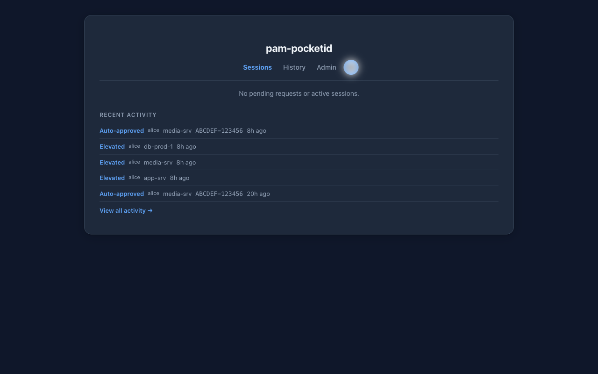
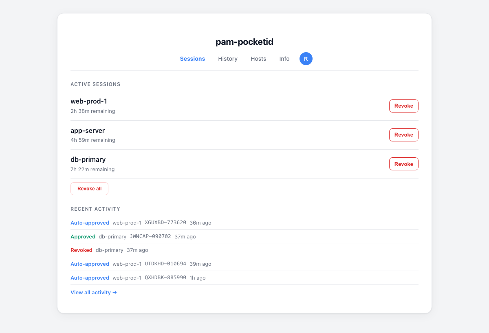
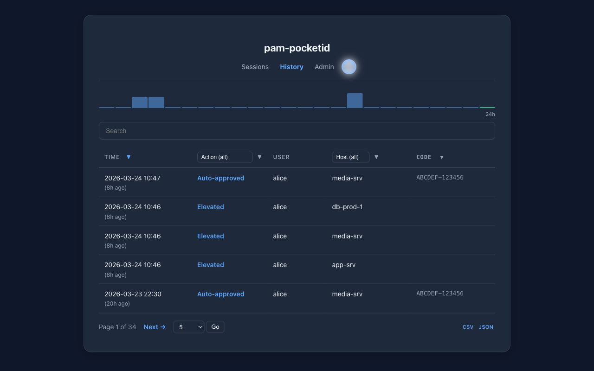
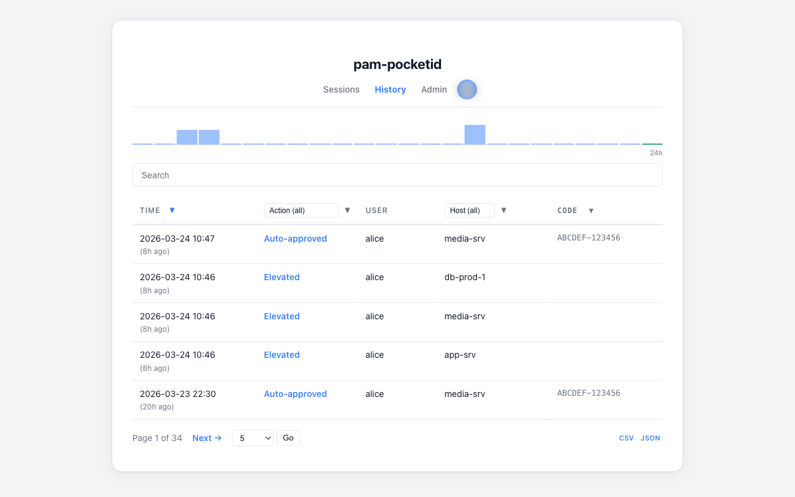
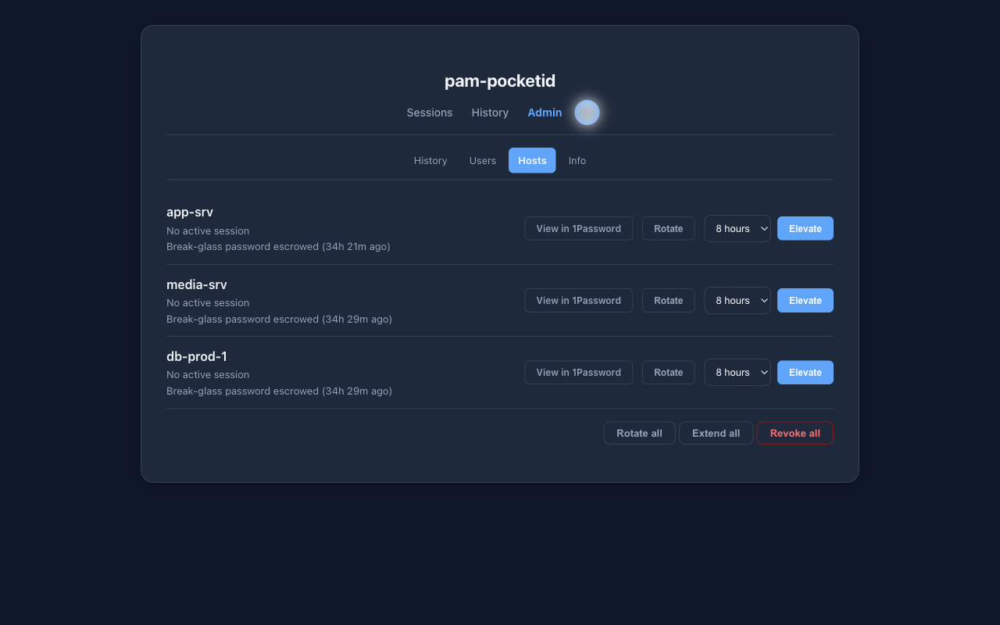
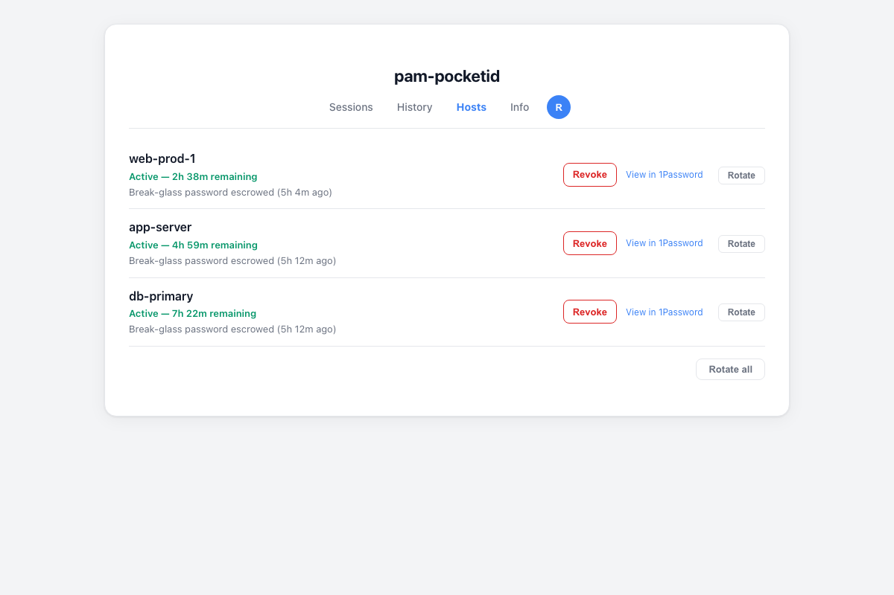
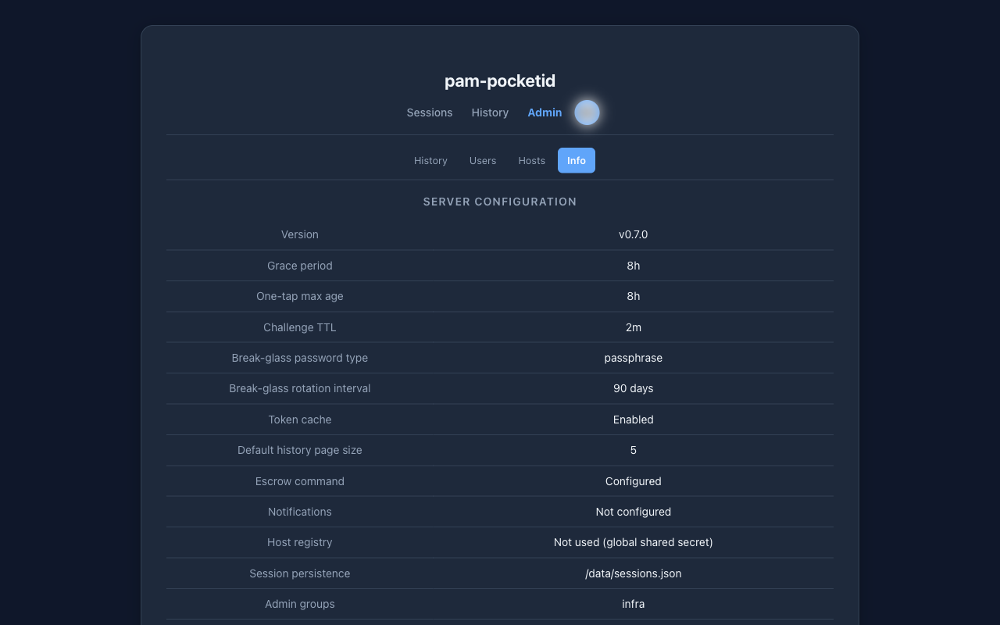
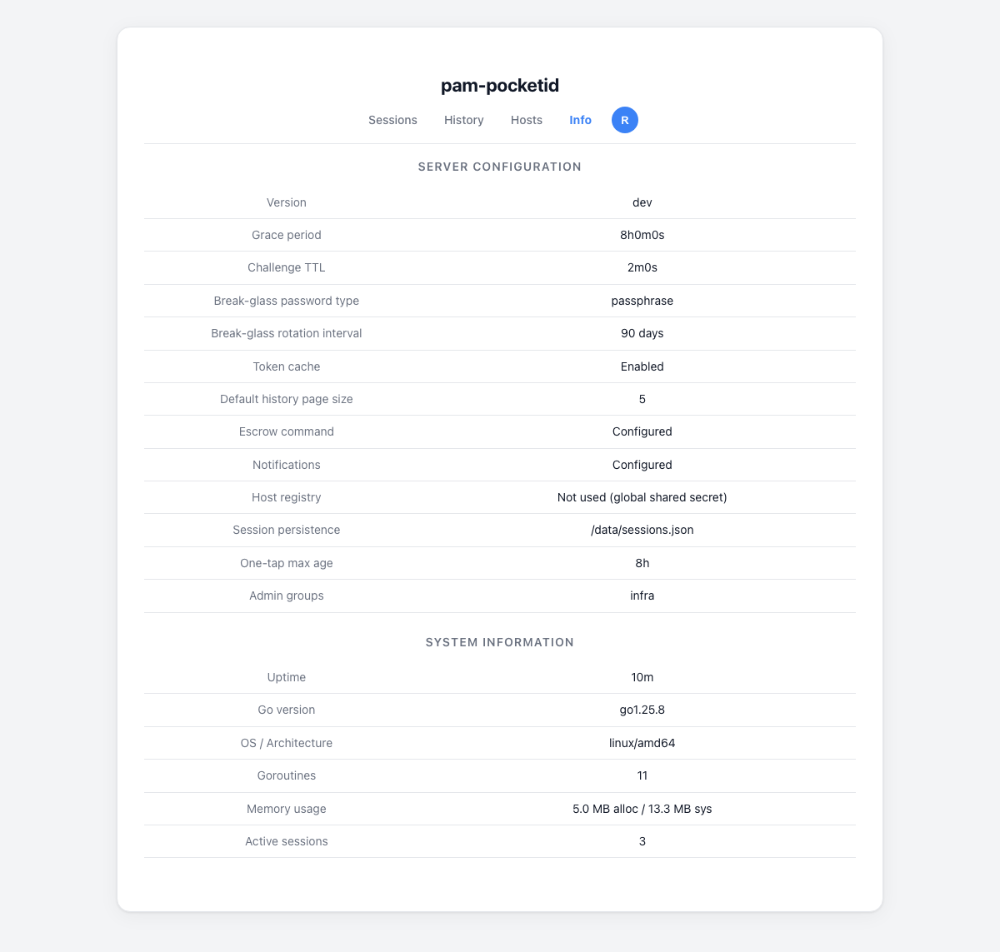
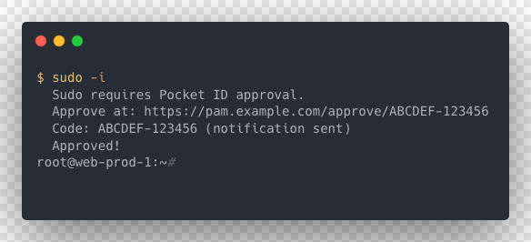

# pam-pocketid

Browser-based sudo elevation via [Pocket ID](https://github.com/pocket-id/pocket-id). When a user runs `sudo`, they're shown a URL and code — authenticate with a passkey in the browser, and sudo proceeds. No passwords required.

> **Note**: The majority of this project's code was generated using AI-powered coding tools, with human direction, design decisions, and review throughout. All features have been extensively tested by hand against real infrastructure.

## Screenshots

### Sessions
| Dark | Light |
|------|-------|
|  |  |

### History
| Dark | Light |
|------|-------|
|  |  |

### Hosts
| Dark | Light |
|------|-------|
|  |  |

### Info
| Dark | Light |
|------|-------|
|  |  |

### Terminal


## How it works

```
 Terminal                    pam-pocketid server             Pocket ID
    |                               |                            |
    | ---- POST /challenge -------> |                            |
    |      {user: jordan}           |                            |
    |                               |                            |
    | <----- url + code ----------- |                            |
    |                               |                            |
    | "Approve at:                  |                            |
    |  sudo.example.com/            |                            |
    |  approve/ABCDEF-123456"       |                            |
    |                               |                            |
    |    User opens URL ----------> | Approval page              |
    |                               |                            |
    |                               | ---- OIDC auth code -----> |
    |                               |                            |
    |                               |              Passkey login |
    |                               |                            |
    |                               | <--- callback (id_token) - |
    |                               |                            |
    |                               | Verify: username matches   |
    |                               | Challenge approved         |
    |                               |                            |
    | <---- poll: approved -------- |                            |
    |                               |                            |
    sudo proceeds                   |                            |
```

Two components:
1. **Server** (`pam-pocketid serve`) — OIDC relay that manages challenges and handles browser auth
2. **PAM helper** (`pam-pocketid`) — called by `pam_exec`, creates challenge, shows URL, polls for approval

## Quick start

### 1. Register an OIDC app in Pocket ID

Create a new OIDC client in Pocket ID:
- **Redirect URI**: `https://sudo.example.com/callback`
- **Scopes**: `openid`, `profile`, `email`

Note the client ID and secret.

### 2. Run the server

```yaml
services:
  pam-pocketid:
    image: ghcr.io/rinseaid/pam-pocketid:latest
    ports:
      - "8090:8090"
    environment:
      PAM_POCKETID_ISSUER_URL: "https://id.example.com"
      PAM_POCKETID_CLIENT_ID: "your-oidc-client-id"
      PAM_POCKETID_CLIENT_SECRET: "your-oidc-client-secret"
      PAM_POCKETID_EXTERNAL_URL: "https://sudo.example.com"
      PAM_POCKETID_SHARED_SECRET: "your-shared-secret"
    restart: unless-stopped
```

### 3. Install the PAM helper on Linux hosts

**Quick install** (downloads latest binary, installs systemd rotation timer):

```bash
curl -fsSL https://raw.githubusercontent.com/rinseaid/pam-pocketid/main/install.sh | sudo bash
```

**Or install manually:**

```bash
curl -L -o /usr/local/bin/pam-pocketid \
  https://github.com/rinseaid/pam-pocketid/releases/latest/download/pam-pocketid-linux-amd64
chmod +x /usr/local/bin/pam-pocketid
```

Configure the helper via `/etc/pam-pocketid.conf`:

```bash
cat > /etc/pam-pocketid.conf <<EOF
PAM_POCKETID_SERVER_URL=https://sudo.example.com
PAM_POCKETID_SHARED_SECRET=your-shared-secret
EOF
chmod 600 /etc/pam-pocketid.conf
```

> pam-pocketid reads this config file directly — no wrapper scripts or environment variable tricks needed. Environment variables, if set, take precedence over config file values.
>
> The config file must be owned by root and have mode 0600. Files with group/other permissions or non-root ownership are silently ignored.

### 4. Configure PAM

Edit `/etc/pam.d/sudo` (and `/etc/pam.d/sudo-i` if it exists):

```
# Pocket ID browser-based authentication
auth    required    pam_exec.so    stdout /usr/local/bin/pam-pocketid

account required    pam_unix.so
session required    pam_limits.so
```

> **Important:** Do not use `expose_authtok` — that flag causes sudo to prompt for a password before invoking pam-pocketid. Since authentication is browser-based, no password is needed.
>
> On some systems, `sudo -i` uses `/etc/pam.d/sudo-i` instead of `/etc/pam.d/sudo`. If `sudo -i` still prompts for a password, copy your `/etc/pam.d/sudo` to `/etc/pam.d/sudo-i`.

### 5. Configure glauth-pocketid for PAM-based sudo auth

In glauth-pocketid, leave `POCKETID_SUDO_NO_AUTHENTICATE` at its default value (`false`). This ensures sudo rules do **not** include `!authenticate`, so sudo will invoke the PAM stack — which now routes through pam-pocketid for browser-based passkey approval instead of asking for a password.

If you previously set `POCKETID_SUDO_NO_AUTHENTICATE=true`, remove it or set it to `false`. Also remove any `sudoOptions=!authenticate` from your Pocket ID group claims.

## What the user sees

**Terminal (normal approval):**
```
$ sudo apt update

  Sudo requires Pocket ID approval.
  Approve at: https://sudo.example.com/approve/ABCDEF-123456
  Code: ABCDEF-123456
  (A notification has also been sent.)

  Waiting for approval (expires in 120s).....
  Approved!

[sudo] runs the command
```

**Terminal (break-glass fallback when server is down):**
```
$ sudo whoami

  *** BREAK-GLASS AUTHENTICATION ***
  The Pocket ID server is unreachable.
  Enter the break-glass password to proceed.

Break-glass password: ********
  Break-glass authentication successful.

root
```

**Terminal (grace period auto-approval):**
```
$ sudo systemctl restart nginx

  Sudo approved (recent authentication).

[sudo] runs the command
```

## Web dashboard

The server exposes a full web dashboard at the `PAM_POCKETID_EXTERNAL_URL`. Users authenticate via Pocket ID OIDC (passkey) to access it. The dashboard is organized into four tabs:

### Sessions tab (/)

The default view. Shows:
- **Pending challenges** — sudo requests waiting for approval, sorted by urgency (soonest to expire first). Each pending challenge shows the hostname, code, and time remaining. Approve or reject individual challenges, or use "Approve all" / "Reject all" to bulk-act.
- **Active grace sessions** — hosts where the grace period is currently active. Revoke individual sessions or revoke all at once.
- **Recent history** — the last 5 actions (approvals, rejections, revocations). A "View all" link goes to the History tab.

### History tab (/history)

Full audit log of all user actions:
- **Sortable columns** — click any column header (Timestamp, Action, Host, Code) to sort ascending or descending
- **Filter dropdowns** — filter by action type and/or hostname using dropdowns populated from actual history data
- **Live search** — search box filters by hostname or challenge code as you type (no page reload)
- **Pagination** — configurable per-page size (5, 10, 25, 50, 100, 500, 1000 entries), with prev/next navigation
- **CSV/JSON export** — download full history as `pam-pocketid-history.csv` or `pam-pocketid-history.json`
- **Timezone-aware timestamps** — times displayed in the user's selected timezone (auto-detected from browser, selectable in profile)

### Hosts tab (/hosts)

Manage known hosts (hosts that have previously requested sudo or are in the host registry):
- **Manual elevation** — grant a grace session for a host without going through a full sudo challenge. Duration selector offers 1h, 4h, 8h, or 1d options (filtered to not exceed the server's configured `GracePeriod`).
- **Revoke sessions** — revoke the grace period for individual hosts directly from this page
- **Break-glass rotation** — request an immediate break-glass password rotation for a single host or all hosts at once. The rotation signal is delivered on the next sudo invocation (PAM client checks and rotates).
- **Escrow status** — if escrow is configured, shows age of the escrowed password and whether it has exceeded the rotation interval (shown as expired)
- **1Password / escrow links** — if `PAM_POCKETID_ESCROW_LINK_TEMPLATE` is set, a button links directly to the stored credential in your secrets manager (1Password, Vault, etc.)
- **Host registry** — shows which hosts are registered with per-host secrets and which users are authorized on each

### Info tab (/info)

Read-only view of server configuration and runtime info:
- Server version, grace period, challenge TTL, default history page size
- Break-glass password type, rotation interval, escrow status, notification status
- Host registry status (global secret or per-host secrets, number of registered hosts)
- Session persistence path
- System info: uptime, Go version, OS/arch, goroutine count, memory usage
- Active grace session count for the current user

### Profile dropdown

Accessible from the avatar in the top-right corner of every dashboard page:
- **Avatar** — fetched from the OIDC `picture` claim (set by Pocket ID); falls back to a letter avatar
- **Theme toggle** — choose System (follows OS preference), Dark, or Light. Preference persisted in a cookie for 1 year.
- **Timezone selector** — select your timezone; times on the History page are displayed in this timezone. Auto-detected from the browser on first visit.
- **Language selector** — switch the dashboard UI language. See [Internationalization](#internationalization) below.
- **Sign out** — clears the session cookie and redirects to the OIDC login page

### Live updates (Server-Sent Events)

The dashboard subscribes to a per-user SSE stream at `/events`. Pending challenges, grace session changes, and history entries are pushed to the browser in real time — no polling or manual refresh required. Each browser tab maintains its own SSE connection; connections are cleaned up automatically on tab close.

### Multi-user admin dashboard

Users who are members of a group listed in `PAM_POCKETID_ADMIN_GROUPS` gain admin access to the dashboard. Admins see a user switcher that lets them view and manage challenges and sessions for any user — approve, reject, or revoke on behalf of others. Non-admin users see only their own data.

```yaml
environment:
  PAM_POCKETID_ADMIN_GROUPS: "admins,ops-team"
```

### One-tap approval from notifications

Push notification messages include a direct approval URL. When a user taps the link from their phone:

1. If their existing OIDC session is fresh (within `PAM_POCKETID_ONETAP_MAX_AGE` seconds, default 300), the challenge is approved immediately — **no second login required**.
2. If the session has expired, the user is redirected through a standard OIDC login first.

This makes mobile approval a single tap in the common case.

## Internationalization

The dashboard UI is fully translated into 8 languages:

| Code | Language |
|---|---|
| `en` | English |
| `es` | Español |
| `fr` | Français |
| `de` | Deutsch |
| `ja` | 日本語 |
| `zh` | 中文 |
| `pt` | Português |
| `ko` | 한국어 |

Language is detected in priority order:
1. `pam_lang` cookie (set via language selector in the profile dropdown)
2. `Accept-Language` HTTP header (browser's configured language)
3. English as the fallback

## Configuration

### Server environment variables

| Variable | Default | Description |
|---|---|---|
| `PAM_POCKETID_ISSUER_URL` | *(required)* | Pocket ID OIDC issuer URL |
| `PAM_POCKETID_CLIENT_ID` | *(required)* | OIDC client ID |
| `PAM_POCKETID_CLIENT_SECRET` | *(required)* | OIDC client secret |
| `PAM_POCKETID_EXTERNAL_URL` | *(required)* | Public URL of this server |
| `PAM_POCKETID_SHARED_SECRET` | *(required)* | Shared secret for PAM helper auth (min 16 chars) |
| `PAM_POCKETID_ADMIN_GROUPS` | *(empty)* | Comma-separated OIDC group names with admin dashboard access (can manage all users' challenges) |
| `PAM_POCKETID_ONETAP_MAX_AGE` | `300` | Max OIDC session age in seconds for one-tap approval without re-login |
| `PAM_POCKETID_LISTEN` | `:8090` | Listen address |
| `PAM_POCKETID_CHALLENGE_TTL` | `120` | Challenge lifetime in seconds (10–600) |
| `PAM_POCKETID_GRACE_PERIOD` | `0` | Skip re-auth if user approved within this many seconds, per-host (0 = disabled, max 86400) |
| `PAM_POCKETID_SESSION_STATE_FILE` | *(none)* | Path to JSON file for persisting grace sessions and history across restarts |
| `PAM_POCKETID_HOST_REGISTRY_FILE` | *(none)* | Path to JSON file for per-host secrets (auto-derived from `SESSION_STATE_FILE` if not set) |
| `PAM_POCKETID_HISTORY_PAGE_SIZE` | `5` | Default entries per page on the History tab (5/10/25/50/100/500/1000) |
| `PAM_POCKETID_NOTIFY_COMMAND` | *(empty)* | Shell command for push notifications on new challenges |
| `PAM_POCKETID_NOTIFY_ENV` | *(empty)* | Comma-separated env var prefixes to pass to notify command |
| `PAM_POCKETID_NOTIFY_USERS_FILE` | *(empty)* | Path to JSON file mapping usernames to per-user notification URLs |
| `PAM_POCKETID_ESCROW_COMMAND` | *(empty)* | Shell command to escrow break-glass passwords |
| `PAM_POCKETID_ESCROW_ENV` | *(empty)* | Comma-separated env var prefixes to pass to escrow command |
| `PAM_POCKETID_ESCROW_LINK_TEMPLATE` | *(empty)* | URL template for viewing escrowed credentials (`{hostname}` and `{item_id}` placeholders) |
| `PAM_POCKETID_ESCROW_LINK_LABEL` | `View credentials` | Label for escrow link button on Hosts tab |
| `PAM_POCKETID_BREAKGLASS_ROTATE_BEFORE` | *(empty)* | RFC3339 timestamp; signal clients to rotate if their hash file is older |
| `PAM_POCKETID_CLIENT_BREAKGLASS_PASSWORD_TYPE` | *(none)* | Override client breakglass password type (random/passphrase/alphanumeric) |
| `PAM_POCKETID_CLIENT_BREAKGLASS_ROTATION_DAYS` | *(none)* | Override client breakglass rotation interval (days) |
| `PAM_POCKETID_CLIENT_TOKEN_CACHE` | *(none)* | Override client token cache setting (true/false) |
| `PAM_POCKETID_INSECURE` | `false` | Allow unauthenticated API (not recommended for production) |

### PAM helper environment variables

These can be set in `/etc/pam-pocketid.conf` or as environment variables (env takes precedence).

| Variable | Default | Description |
|---|---|---|
| `PAM_POCKETID_SERVER_URL` | *(required)* | URL of the pam-pocketid server |
| `PAM_POCKETID_SHARED_SECRET` | *(empty)* | Shared secret (must match server, min 16 chars) |
| `PAM_POCKETID_POLL_MS` | `2000` | Poll interval in milliseconds (500–30000) |
| `PAM_POCKETID_TIMEOUT` | `120` | Max seconds to wait for approval (10–600) |
| `PAM_POCKETID_BREAKGLASS_ENABLED` | `true` | Enable break-glass fallback authentication |
| `PAM_POCKETID_BREAKGLASS_FILE` | `/etc/pam-pocketid-breakglass` | Path to break-glass bcrypt hash file |
| `PAM_POCKETID_BREAKGLASS_ROTATION_DAYS` | `90` | Automatic rotation interval in days (1–3650) |
| `PAM_POCKETID_BREAKGLASS_PASSWORD_TYPE` | `random` | Password type: random, passphrase, or alphanumeric |
| `PAM_POCKETID_TOKEN_CACHE` | `true` | Enable/disable OIDC token caching |
| `PAM_POCKETID_TOKEN_CACHE_DIR` | `/run/pocketid` | Directory for cached tokens |
| `PAM_POCKETID_ISSUER_URL` | *(none)* | OIDC issuer URL for local JWT validation (enables token cache) |
| `PAM_POCKETID_CLIENT_ID` | *(none)* | OIDC client ID for audience verification (enables token cache) |

## CLI reference

| Command | Description |
|---|---|
| `pam-pocketid` | PAM helper (called by pam_exec, not run directly) |
| `pam-pocketid serve` | Run the authentication server |
| `pam-pocketid rotate-breakglass [--force]` | Rotate the break-glass password |
| `pam-pocketid verify-breakglass` | Verify a break-glass password against the stored hash |
| `pam-pocketid add-host <hostname> [--users user1,user2]` | Register a host with a generated per-host secret |
| `pam-pocketid remove-host <hostname>` | Unregister a host |
| `pam-pocketid list-hosts` | List all registered hosts |
| `pam-pocketid rotate-host-secret <hostname>` | Generate a new secret for a registered host |
| `pam-pocketid --version` | Show version |
| `pam-pocketid --help` | Show usage information |

## Push notifications

When a new sudo challenge is created, the server can run a shell command to send a push notification to your phone. This lets you tap the approval URL directly from the notification instead of copy-pasting from the terminal.

Notifications are **not** sent for grace-period auto-approvals (no action needed).

### Using Apprise (recommended)

[Apprise](https://github.com/caronc/apprise) supports 80+ notification services with a single tool. It's included in the Docker image.

```yaml
# docker-compose.yml
environment:
  PAM_POCKETID_NOTIFY_COMMAND: >-
    apprise -t "Sudo approval needed"
    -b "User: $NOTIFY_USERNAME\nHost: $NOTIFY_HOSTNAME\nCode: $NOTIFY_USER_CODE\nApprove: $NOTIFY_APPROVAL_URL\nExpires: ${NOTIFY_EXPIRES_IN}s"
    "$APPRISE_URLS"
  PAM_POCKETID_NOTIFY_ENV: "APPRISE_"
```

Set `APPRISE_URLS` to one or more notification service URLs (space-separated):

```bash
# Telegram
APPRISE_URLS="tgram://bot_token/chat_id"

# ntfy
APPRISE_URLS="ntfy://ntfy.sh/my-sudo-alerts"

# Pushover
APPRISE_URLS="pover://user_key@app_token"

# Gotify
APPRISE_URLS="gotify://gotify.example.com/token"

# Multiple services at once
APPRISE_URLS="tgram://bot/chat ntfy://ntfy.sh/sudo-alerts"
```

### Using Apprise API (stateless notifications via HTTP)

If you run [Apprise API](https://github.com/caronc/apprise/wiki/API_Details) as a separate service (e.g., [linuxserver/apprise-api](https://github.com/linuxserver/docker-apprise-api)), pam-pocketid can send notifications via HTTP instead of invoking the Apprise CLI directly. This keeps notification credentials (bot tokens, chat IDs) centralized in the Apprise API service and out of the pam-pocketid container.

Connect pam-pocketid to the Apprise API service's Docker network, then use a small Python script as the notify command. This avoids shell quoting issues with inline JSON and lets you use markdown formatting:

```python
# notify.py — mount into the container at /app/notify.py
#!/usr/bin/env python3
"""Send sudo approval notification via apprise-api."""
import json, os, urllib.request

username = os.environ["NOTIFY_USERNAME"]
hostname = os.environ["NOTIFY_HOSTNAME"]
user_code = os.environ["NOTIFY_USER_CODE"]
approval_url = os.environ["NOTIFY_APPROVAL_URL"]
expires_in = os.environ["NOTIFY_EXPIRES_IN"]

data = json.dumps({
    "title": "Sudo approval needed",
    "body": (
        f"**User:** {username}\n"
        f"**Host:** {hostname}\n"
        f"**Code:** `{user_code}`\n"
        f"**Expires:** {expires_in}s\n\n"
        f"[Approve]({approval_url})"
    ),
    "format": "markdown",
}).encode()

req = urllib.request.Request(
    "http://apprise-api:8000/notify/sudo",
    data,
    {"Content-Type": "application/json"},
)
urllib.request.urlopen(req)
```

```yaml
# docker-compose.yml
services:
  pam-pocketid:
    environment:
      PAM_POCKETID_NOTIFY_COMMAND: "python3 /app/notify.py"
    volumes:
      - ./notify.py:/app/notify.py:ro
    networks:
      - notify  # shared network with apprise-api

networks:
  notify:
    external: true
```

The `/notify/sudo` path corresponds to a named tag in Apprise API. Configure the tag in Apprise API to point at your desired notification service (Telegram, ntfy, Slack, etc.). This approach requires no secrets in the pam-pocketid container — the Apprise API service handles all credential management.

For per-user routing with Apprise API, create separate tags per user (e.g., `sudo-rinseaid`, `sudo-jordan`) and change the URL in the script to include the username:

```python
req = urllib.request.Request(
    f"http://apprise-api:8000/notify/sudo-{username}",
    ...
)
```

If the tag doesn't exist for a user, Apprise API returns an error and pam-pocketid logs it — the sudo challenge is never blocked.

### Using a custom command

Any shell command works. The following environment variables are available:

| Variable | Example | Description |
|---|---|---|
| `NOTIFY_USERNAME` | `jordan` | User requesting sudo |
| `NOTIFY_HOSTNAME` | `web-prod-1` | Host where sudo was invoked |
| `NOTIFY_USER_CODE` | `ABCDEF-123456` | Challenge code |
| `NOTIFY_APPROVAL_URL` | `https://sudo.example.com/approve/ABCDEF-123456` | Clickable approval link |
| `NOTIFY_EXPIRES_IN` | `120` | Seconds until challenge expires |
| `NOTIFY_USER_URLS` | `tgram://bot/12345` | Per-user notification URL(s) from mapping file (empty if no mapping) |

Notification failures never block sudo — the challenge is created regardless, and the approval URL is always shown in the terminal.

Example with curl to ntfy:

```yaml
environment:
  PAM_POCKETID_NOTIFY_COMMAND: >-
    curl -s
    -H "Title: Sudo approval needed"
    -H "Click: $NOTIFY_APPROVAL_URL"
    -d "Sudo: $NOTIFY_USERNAME@$NOTIFY_HOSTNAME — Code: $NOTIFY_USER_CODE — $NOTIFY_APPROVAL_URL"
    ntfy.sh/my-sudo-alerts
  # The Click: header makes the notification clickable in ntfy mobile/desktop apps
```

### Per-user routing

By default, all notifications go to the same destination. To route notifications to individual users (e.g., each person gets their own Telegram message), create a JSON mapping file:

```json
{
  "hazely": "tgram://bot_token/hazely_chat_id",
  "sunny": "tgram://bot_token/sunny_chat_id ntfy://ntfy.sh/sunny-alerts",
  "*": "slack://token/channel/#ops-alerts"
}
```

- Each key is a username, mapped to one or more Apprise URLs (space-separated).
- `"*"` is the fallback for users without an explicit entry (optional but recommended).
- The file must be an absolute path, mode `0600`, and owned by root (it contains bot tokens).
- The file is re-read on each notification, so changes take effect without restarting the server.
- When adding new system users, remember to add their notification mapping. Users without a mapping (and no `"*"` fallback) will not receive push notifications.

Point the server at the file. The recommended pattern combines per-user URLs with a global ops channel, so unmapped users still generate an ops notification:

```yaml
environment:
  PAM_POCKETID_NOTIFY_USERS_FILE: /etc/pam-pocketid-notify-users.json
  PAM_POCKETID_NOTIFY_COMMAND: >-
    apprise -t "Sudo approval needed"
    -b "User: $NOTIFY_USERNAME\nHost: $NOTIFY_HOSTNAME\nCode: $NOTIFY_USER_CODE\nApprove: $NOTIFY_APPROVAL_URL\nExpires: ${NOTIFY_EXPIRES_IN}s"
    $NOTIFY_USER_URLS "$APPRISE_OPS_CHANNEL"
  PAM_POCKETID_NOTIFY_ENV: "APPRISE_"
```

For per-user only routing (no global ops channel), use a `"*"` wildcard in the JSON to ensure every user has a destination, or guard the command to skip when empty:

```yaml
  PAM_POCKETID_NOTIFY_COMMAND: >-
    [ -z "$NOTIFY_USER_URLS" ] && exit 0;
    apprise -t "Sudo approval needed"
    -b "User: $NOTIFY_USERNAME\nHost: $NOTIFY_HOSTNAME\nApprove: $NOTIFY_APPROVAL_URL"
    $NOTIFY_USER_URLS
```

The per-user URL(s) are passed as `NOTIFY_USER_URLS`. Do not quote `$NOTIFY_USER_URLS` in the command — when unquoted, shell word splitting correctly passes multiple space-separated URLs as separate arguments to apprise. Quoting it would pass the entire string as a single (invalid) URL.

### Limitations

- Notifications are best-effort with no retry on failure.
- Concurrency is limited to 10 simultaneous notification commands; excess notifications are skipped.
- Each notification command has a 15-second timeout.
- Per-user routing requires a JSON mapping file (see above); without it, all challenges go to the same destination.
- Failures are logged but never block the sudo challenge flow.

## Token cache

The PAM helper can cache OIDC ID tokens locally to allow subsequent sudo invocations without a full device flow. When a cached token is valid, sudo is approved instantly with no browser interaction.

To enable the token cache, set `PAM_POCKETID_ISSUER_URL` and `PAM_POCKETID_CLIENT_ID` on the PAM helper (client side). These are used for local JWT signature and audience verification. Tokens are stored in `PAM_POCKETID_TOKEN_CACHE_DIR` (default `/run/pocketid`), one file per username.

The server can also push a token cache setting to all clients via `PAM_POCKETID_CLIENT_TOKEN_CACHE` (set to `true` or `false`). The server-pushed setting overrides the client-side setting after HMAC verification.

## Grace periods

The server can skip re-authentication for a user if they approved a sudo request recently — on the same host. Grace periods are strictly per-host: approving sudo on `web-prod-1` does not grant a grace period on `web-prod-2`.

Grace sessions are **not rolling** — approving a second sudo during an active grace session does not extend the session. The session expires at the fixed time set when it was created.

Set the maximum grace duration with `PAM_POCKETID_GRACE_PERIOD` (in seconds). Grace sessions can also be created manually from the Hosts tab in the web dashboard, up to the configured maximum.

To persist grace sessions across server restarts, set `PAM_POCKETID_SESSION_STATE_FILE` to a file path (e.g., `/data/sessions.json`). Without this, all grace sessions are lost on restart.

## Session management

After authenticating to the dashboard via Pocket ID OIDC (passkey), users receive a signed session cookie valid for 30 minutes. The session is refreshed on every dashboard page load (sliding window).

From the dashboard, users can:
- **Approve** pending challenges (individually or all at once)
- **Reject** pending challenges (individually or all at once) — the PAM client immediately receives a denial and sudo fails
- **Revoke** active grace sessions (individually or all at once)
- **Elevate** a host manually to create a grace session without a sudo invocation

## Server-side client config

The server can push configuration overrides to PAM helper clients. These overrides are delivered in the challenge response after HMAC verification, so a MITM cannot inject them without invalidating the approval token.

Available overrides:
- `PAM_POCKETID_CLIENT_BREAKGLASS_PASSWORD_TYPE` — Override the client's break-glass password type (random/passphrase/alphanumeric)
- `PAM_POCKETID_CLIENT_BREAKGLASS_ROTATION_DAYS` — Override the client's break-glass rotation interval
- `PAM_POCKETID_CLIENT_TOKEN_CACHE` — Enable or disable the client's token cache (true/false)

These are set as server environment variables and take effect on the next challenge creation. Client-side settings are used as defaults when no server override is configured.

## Break-glass authentication

Break-glass is a fallback authentication mechanism that activates when the pam-pocketid server is unreachable. It allows sudo to proceed using a locally stored password, ensuring you are never locked out of your hosts.

### When it activates

Break-glass only activates on **network-level failures** — dial errors (connection refused, host unreachable) and DNS resolution failures. It does **not** activate on HTTP errors (e.g., 500 Internal Server Error) or request timeouts, because those indicate the server is reachable but having issues. This distinction prevents a malicious server from intentionally triggering break-glass fallback.

### Setup

Generate a break-glass password on each managed host:

```bash
pam-pocketid rotate-breakglass
```

This generates a password, stores a bcrypt hash at `/etc/pam-pocketid-breakglass`, and optionally escrows the plaintext to the server. If escrow is not configured, the password is printed to stdout — save it securely.

### Password types

| Type | Format | Entropy |
|---|---|---|
| `random` (default) | 32 random bytes, base64url-encoded (43 chars) | 256 bits |
| `passphrase` | 10 words joined with dashes (e.g., `calm-grip-hawk-note-surf-atom-bold-deer-flux-iron`) | 80 bits |
| `alphanumeric` | 24 unambiguous alphanumeric characters | ~138 bits |

Set via `PAM_POCKETID_BREAKGLASS_PASSWORD_TYPE` in `/etc/pam-pocketid.conf`.

### Rotation

Passwords are rotated automatically through two complementary mechanisms:

1. **Systemd timer** (recommended) — a weekly timer runs `rotate-breakglass`, ensuring all hosts rotate within the configured interval regardless of sudo activity. The install script sets this up automatically.

2. **Opportunistic** — every successful sudo checks the hash file age against `PAM_POCKETID_BREAKGLASS_ROTATION_DAYS` (default 90 days) and rotates if due.

Both mechanisms use file locking to prevent races. If the timer rotated at 3 AM and a sudo happens at 9 AM, the age check skips (password is fresh).

To install the timer manually (if not using the install script):

```bash
# Copy from the repo's systemd/ directory, or download:
curl -fsSL -o /etc/systemd/system/pam-pocketid-rotate.service \
  https://raw.githubusercontent.com/rinseaid/pam-pocketid/main/systemd/pam-pocketid-rotate.service
curl -fsSL -o /etc/systemd/system/pam-pocketid-rotate.timer \
  https://raw.githubusercontent.com/rinseaid/pam-pocketid/main/systemd/pam-pocketid-rotate.timer
systemctl daemon-reload
systemctl enable --now pam-pocketid-rotate.timer
```

To force an immediate rotation:

```bash
pam-pocketid rotate-breakglass --force
```

The server can signal all clients to rotate by setting `PAM_POCKETID_BREAKGLASS_ROTATE_BEFORE` to an RFC3339 timestamp. Clients with hash files older than this timestamp will rotate on the next sudo or timer run. Individual hosts can also be signaled from the Hosts tab in the web dashboard (Rotate / Rotate All buttons).

### Rate limiting

After 3 consecutive failed break-glass attempts, exponential backoff kicks in: 1s, 2s, 4s, ... up to a maximum of 300s. The failure counter is stored in `/var/run/pam-pocketid-breakglass-failures` (tmpfs, resets on reboot) and is cleared on successful authentication.

### Escrow

The server can escrow break-glass passwords to any external system by configuring `PAM_POCKETID_ESCROW_COMMAND`. The command receives the plaintext password on **stdin** and the hostname via `BREAKGLASS_HOSTNAME`. The escrow mechanism is not tied to any specific secrets manager — any shell command works:

```bash
# 1Password (via SDK — Python script included in Docker image)
PAM_POCKETID_ESCROW_COMMAND: "python3 /app/breakglass-escrow.py"

# HashiCorp Vault
PAM_POCKETID_ESCROW_COMMAND: "vault kv put secret/breakglass/$BREAKGLASS_HOSTNAME password=-"

# AWS Secrets Manager
PAM_POCKETID_ESCROW_COMMAND: >-
  aws secretsmanager put-secret-value
  --secret-id breakglass-$BREAKGLASS_HOSTNAME
  --secret-string $(cat)

# Bitwarden (via CLI)
PAM_POCKETID_ESCROW_COMMAND: >-
  bw get item breakglass-$BREAKGLASS_HOSTNAME 2>/dev/null
  && bw edit item-password breakglass-$BREAKGLASS_HOSTNAME $(cat)
  || bw create item --name breakglass-$BREAKGLASS_HOSTNAME --password $(cat)

# Write to a local file (simple, no external dependencies)
PAM_POCKETID_ESCROW_COMMAND: "cat > /secure/breakglass/$BREAKGLASS_HOSTNAME.txt"
```

Use `PAM_POCKETID_ESCROW_ENV` to pass through environment variable prefixes needed by your secrets manager (e.g., `AWS_,VAULT_,OP_`).

Each host can only escrow for its own hostname (verified via an HMAC-based per-host token).

#### 1Password integration

The Docker image includes the [1Password Python SDK](https://developer.1password.com/docs/sdks/). A ready-to-use escrow script (`/app/breakglass-escrow.py`) is included in the image. The script creates or updates a 1Password item for each host. Set the `OP_SERVICE_ACCOUNT_TOKEN` env var and configure the escrow link template to link directly to 1Password:

```yaml
environment:
  PAM_POCKETID_ESCROW_COMMAND: "python3 /app/breakglass-escrow.py"
  PAM_POCKETID_ESCROW_ENV: "OP_"
  PAM_POCKETID_ESCROW_LINK_TEMPLATE: "op://Private/breakglass-{hostname}"
  PAM_POCKETID_ESCROW_LINK_LABEL: "Open in 1Password"
```

When the escrow script outputs `item_id=<id>`, the server stores the ID and can use it in `{item_id}` placeholders in `ESCROW_LINK_TEMPLATE`.

### Verification

To test a break-glass password against the stored hash without triggering a sudo session:

```bash
pam-pocketid verify-breakglass
```

## Host registry

The host registry enables per-host secrets as an alternative to a single global `PAM_POCKETID_SHARED_SECRET`. When any hosts are registered, the server requires each host to authenticate with its own unique secret. This isolates hosts: a compromised host's secret cannot be used to create challenges for other hosts.

### Registering hosts

Run these commands on the server (or inside the server container):

```bash
# Register a host — all users allowed
pam-pocketid add-host web-prod-1

# Register a host — specific users only
pam-pocketid add-host web-prod-2 --users jordan,alex

# The command prints the generated secret to stdout.
# Copy it to /etc/pam-pocketid.conf on the host:
#   PAM_POCKETID_SHARED_SECRET=<generated-secret>

# List registered hosts
pam-pocketid list-hosts

# Rotate a host's secret (e.g., after a compromise)
pam-pocketid rotate-host-secret web-prod-1

# Remove a host
pam-pocketid remove-host web-prod-1
```

Set `PAM_POCKETID_HOST_REGISTRY_FILE` to a persistent path (e.g., `/data/hosts.json`). If not set but `PAM_POCKETID_SESSION_STATE_FILE` is configured, the registry defaults to `hosts.json` in the same directory.

When the host registry is active, only registered hosts can create challenges, and only users listed in a host's `users` field (or `*` for all users) can authenticate via that host.

## Monitoring

### Health check

`GET /healthz` returns `ok` with HTTP 200. Use this for load balancer or container health checks.

### Prometheus metrics

`GET /metrics` exposes metrics in Prometheus format. All metrics are prefixed with `pam_pocketid_`.

| Metric | Type | Labels | Description |
|---|---|---|---|
| `challenges_created_total` | counter | | Total sudo challenges created |
| `challenges_approved_total` | counter | | Challenges approved via OIDC authentication |
| `challenges_auto_approved_total` | counter | | Challenges auto-approved via grace period |
| `challenges_denied_total` | counter | `reason` | Challenges denied (reasons: `oidc_error`, `nonce_mismatch`, `identity_mismatch`, `user_rejected`) |
| `challenges_expired_total` | counter | | Challenges that expired without resolution |
| `challenge_duration_seconds` | histogram | | Time from challenge creation to resolution |
| `rate_limit_rejections_total` | counter | | Challenge creation requests rejected by rate limiting |
| `auth_failures_total` | counter | | Requests rejected due to invalid shared secret |
| `active_challenges` | gauge | | Number of currently pending challenges |
| `grace_sessions_active` | gauge | | Current number of active grace period sessions |
| `breakglass_escrow_total` | counter | `status` | Break-glass escrow operations (status: `success`, `failure`) |
| `notifications_total` | counter | `status` | Push notification attempts (status: `sent`, `failed`, `skipped`) |
| `oidc_exchange_duration_seconds` | histogram | | Time spent on OIDC token exchange with the identity provider |
| `registered_hosts` | gauge | | Number of hosts registered in the host registry |

## Docker deployment

### Image

```
ghcr.io/rinseaid/pam-pocketid:latest
```

The image is built on `debian:bookworm-slim` and includes:
- The `pam-pocketid` binary
- Python 3 with `apprise` (for push notifications)
- The 1Password Python SDK (`onepassword-sdk`) for break-glass escrow
- `ca-certificates` for TLS

The server runs as a non-root user (`pampocketid`) with a built-in healthcheck on `/healthz`.

### Compose example

```yaml
services:
  pam-pocketid:
    image: ghcr.io/rinseaid/pam-pocketid:latest
    ports:
      - "127.0.0.1:8090:8090"
    environment:
      PAM_POCKETID_ISSUER_URL: "https://id.example.com"
      PAM_POCKETID_CLIENT_ID: "your-oidc-client-id"
      PAM_POCKETID_CLIENT_SECRET: "your-oidc-client-secret"
      PAM_POCKETID_EXTERNAL_URL: "https://sudo.example.com"
      PAM_POCKETID_SHARED_SECRET: "your-shared-secret"
      PAM_POCKETID_SESSION_STATE_FILE: "/data/sessions.json"
      # PAM_POCKETID_GRACE_PERIOD: "28800"
      # PAM_POCKETID_CLIENT_BREAKGLASS_PASSWORD_TYPE: "passphrase"
      # PAM_POCKETID_CLIENT_BREAKGLASS_ROTATION_DAYS: "90"
      # PAM_POCKETID_CLIENT_TOKEN_CACHE: "true"
    volumes:
      - pam-pocketid-data:/data
    stop_grace_period: 30s
    tmpfs:
      - /tmp
    healthcheck:
      test: ["CMD", "wget", "--spider", "-q", "http://localhost:8090/healthz"]
      interval: 30s
      timeout: 5s
      retries: 3
    restart: unless-stopped
    cap_drop:
      - ALL
    security_opt:
      - no-new-privileges:true
    read_only: true

volumes:
  pam-pocketid-data:
```

The server responds to `SIGINT`/`SIGTERM` with a graceful shutdown: in-flight requests drain (10s timeout), pending notifications are waited on (5s), and grace session state is flushed to disk before exit. A second signal forces immediate exit.

## Integration with glauth-pocketid

This project is designed to work alongside [glauth-pocketid](https://github.com/rinseaid/glauth-pocketid). Together they provide a complete passwordless Linux host management stack:

| Component | Role |
|---|---|
| **Pocket ID** | Identity provider — users, groups, passkeys, custom claims |
| **glauth-pocketid** | LDAP bridge — translates Pocket ID users/groups into POSIX accounts, sudo rules, SSH keys |
| **sssd** | Linux client — resolves users/groups via LDAP, delivers sudo rules and SSH keys |
| **pam-pocketid** | sudo auth — browser-based passkey approval when running sudo |

glauth-pocketid defines *what* users can sudo (commands, hosts, run-as user). pam-pocketid defines *how* they authenticate — via passkey in a browser instead of a password.

### How sudo authentication works

When a user runs `sudo`, the `sudoRole` LDAP entries (synthesized by glauth-pocketid) determine what commands they're allowed to run. Then sudo needs to verify who they are:

- If the sudo rule includes `!authenticate`, sudo **skips verification entirely** and runs the command
- If the sudo rule does **not** include `!authenticate`, sudo **invokes the PAM auth stack**

With pam-pocketid installed in the PAM stack, the "invoke PAM" step becomes a browser-based passkey approval instead of a password prompt. The user sees a URL, opens it, taps their passkey, and sudo proceeds.

glauth-pocketid controls whether `!authenticate` appears in sudo rules via `POCKETID_SUDO_NO_AUTHENTICATE`:

| Setting | Behavior | Use with pam-pocketid? |
|---|---|---|
| `false` (default) | Sudo always invokes PAM | **Yes — recommended.** Every sudo invocation requires passkey approval. |
| `true` | Sudo never invokes PAM (`!authenticate` on all rules) | No — pam-pocketid is bypassed entirely. |
| `claims` | Per-group: groups with `sudoOptions=!authenticate` skip PAM, others invoke it | Partial — some groups use passkey auth, others skip it. |

The recommended setup is `false` (the default) + pam-pocketid. This gives you per-invocation identity verification via passkey with zero passwords in the entire chain.

### Full stack Docker Compose

Run both services on your infrastructure. Pocket ID itself can be self-hosted or managed separately.

```yaml
# docker-compose.yml — glauth-pocketid + pam-pocketid
services:
  glauth:
    image: ghcr.io/rinseaid/glauth-pocketid:latest
    ports:
      - "3893:3893"    # LDAP
      - "8080:8080"    # webhook + metrics
    environment:
      POCKETID_BASE_URL: "https://id.example.com"
      POCKETID_API_KEY: "your-pocket-id-api-key"
      POCKETID_REFRESH_SEC: "300"
      POCKETID_PERSIST_PATH: "/var/lib/glauth/uidmap.json"
      POCKETID_WEBHOOK_PORT: "8080"
      # POCKETID_SUDO_NO_AUTHENTICATE is false by default —
      # pam-pocketid handles sudo auth instead
    volumes:
      - glauth-data:/var/lib/glauth
      - ./glauth.cfg:/etc/glauth/glauth.cfg:ro
    restart: unless-stopped

  pam-pocketid:
    image: ghcr.io/rinseaid/pam-pocketid:latest
    ports:
      - "8090:8090"
    environment:
      PAM_POCKETID_ISSUER_URL: "https://id.example.com"
      PAM_POCKETID_CLIENT_ID: "your-oidc-client-id"
      PAM_POCKETID_CLIENT_SECRET: "your-oidc-client-secret"
      PAM_POCKETID_EXTERNAL_URL: "https://sudo.example.com"
      PAM_POCKETID_SHARED_SECRET: "your-shared-secret"
    restart: unless-stopped

volumes:
  glauth-data:
```

### End-to-end setup walkthrough

This walkthrough assumes Pocket ID is already running at `id.example.com` and the Docker Compose stack above is deployed at `glauth.internal` (LDAP) and `sudo.example.com` (pam-pocketid server).

**Step 1: Configure Pocket ID**

1. Create an admin API key in Pocket ID (Settings > Admin API) and set it as `POCKETID_API_KEY`
2. Register an OIDC client for pam-pocketid:
   - Redirect URI: `https://sudo.example.com/callback`
   - Scopes: `openid`, `profile`, `email`
   - Note the client ID and secret for `PAM_POCKETID_CLIENT_ID` / `PAM_POCKETID_CLIENT_SECRET`
3. Add SSH public keys as user custom claims (`sshPublicKey`, `sshPublicKey2`, `sshPublicKey3`, etc.)
4. Create groups with sudo claims:
   ```
   Group: full-admins     Claims: sudoCommands=ALL, sudoHosts=ALL, sudoRunAsUser=ALL
   Group: ops-team        Claims: sudoCommands=/usr/bin/systemctl restart *,/usr/bin/journalctl
   ```
   Do **not** set `sudoOptions=!authenticate` — leave `POCKETID_SUDO_NO_AUTHENTICATE=false` (the default) so that sudo invokes pam-pocketid for passkey-based authentication.
5. Add users to the appropriate groups

**Step 2: Create `glauth.cfg`**

```toml
[ldap]
  enabled = true
  listen  = "0.0.0.0:3893"

[ldaps]
  enabled = false

[backend]
  datastore     = "plugin"
  plugin        = "/app/pocketid.so"
  pluginhandler = "NewPocketIDHandler"
  baseDN        = "dc=example,dc=com"
  nameformat    = "cn"
  groupformat   = "ou"
  sshkeyattr    = "sshPublicKey"
  anonymousdse  = true

# Service account for sssd to bind with
[[users]]
  name         = "serviceuser"
  uidnumber    = 9000
  primarygroup = 9000
  passsha256   = "REPLACE_WITH_SHA256_OF_SERVICE_ACCOUNT_PASSWORD"

[[users.capabilities]]
  action = "search"
  object = "ou=users,dc=example,dc=com"

[[groups]]
  name      = "svcaccts"
  gidnumber = 9000
```

Generate the password hash: `echo -n 'your-service-password' | sha256sum`

**Step 3: Start the stack**

```bash
docker compose up -d
```

Verify LDAP is working:
```bash
ldapsearch -x -H ldap://glauth.internal:3893 \
  -D "cn=serviceuser,ou=svcaccts,dc=example,dc=com" \
  -w 'your-service-password' \
  -b "dc=example,dc=com" "(objectClass=posixAccount)"
```

**Step 4: Configure each Linux host**

Install sssd and configure it to use GLAuth:

```ini
# /etc/sssd/sssd.conf — mode 0600, owned by root
[sssd]
services = nss, pam, sudo, ssh
domains = example.com

[domain/example.com]
id_provider     = ldap
auth_provider   = none
sudo_provider   = ldap

ldap_uri        = ldap://glauth.internal:3893
ldap_search_base = dc=example,dc=com
ldap_default_bind_dn = cn=serviceuser,ou=svcaccts,dc=example,dc=com
ldap_default_authtok = your-service-password

enumerate = true

ldap_user_object_class   = posixAccount
ldap_group_object_class  = posixGroup
ldap_user_name           = cn
ldap_user_uid_number     = uidNumber
ldap_user_gid_number     = gidNumber
ldap_user_home_directory = homeDirectory
ldap_user_shell          = loginShell
ldap_user_ssh_public_key = sshPublicKey

ldap_group_name   = ou
ldap_group_member = memberUid

ldap_sudo_search_base = ou=sudoers,dc=example,dc=com

ldap_schema = rfc2307

entry_cache_timeout = 60

[sudo]
sudo_timed = false
```

Configure NSS (`/etc/nsswitch.conf`):
```
passwd:  files sss
group:   files sss
shadow:  files sss
sudoers: files sss
```

Configure SSH key delivery (`/etc/ssh/sshd_config`):
```
AuthorizedKeysCommand /usr/bin/sss_ssh_authorizedkeys %u
AuthorizedKeysCommandUser root
PubkeyAuthentication yes
PasswordAuthentication no
```

Auto-create home directories (`/etc/pam.d/common-session`):
```
session optional pam_mkhomedir.so skel=/etc/skel umask=0077
```

**Step 5: Install pam-pocketid on each Linux host**

```bash
# Install the PAM helper binary
curl -L -o /usr/local/bin/pam-pocketid \
  https://github.com/rinseaid/pam-pocketid/releases/latest/download/pam-pocketid-linux-amd64
chmod +x /usr/local/bin/pam-pocketid

# Configure the helper
cat > /etc/pam-pocketid.conf <<EOF
PAM_POCKETID_SERVER_URL=https://sudo.example.com
PAM_POCKETID_SHARED_SECRET=your-shared-secret
EOF
chmod 600 /etc/pam-pocketid.conf

# Configure PAM for sudo (and sudo -i)
cat > /etc/pam.d/sudo <<EOF
auth    required    pam_exec.so    stdout /usr/local/bin/pam-pocketid
account required    pam_unix.so
session required    pam_limits.so
EOF
cp /etc/pam.d/sudo /etc/pam.d/sudo-i
```

Restart sssd and sshd:
```bash
systemctl restart sssd sshd
```

**Step 6: Verify everything works**

```bash
# User/group resolution via sssd + GLAuth
getent passwd jordan
getent group full-admins

# SSH key delivery
sss_ssh_authorizedkeys jordan

# Sudo rules
sudo -l -U jordan

# Sudo with passkey auth (will show approval URL)
sudo whoami
```

When a user runs `sudo`, they see a URL and approval code. They open the URL in a browser, authenticate with their passkey via Pocket ID, and sudo proceeds -- no password needed anywhere in the chain.

## Security features

- **HMAC-SHA256 authentication** — All PAM client-server communication is authenticated with a shared secret. Status responses (approved, denied) include HMAC tokens so the PAM client can verify they are genuine and not MITM-injected.
- **CSRF protection** — Dashboard forms include a cryptographic CSRF token (HMAC of username + timestamp) verified server-side. Tokens expire after 5 minutes.
- **CSP nonce** — A per-request random nonce is included in the `Content-Security-Policy` header to allow exactly one inline script (timezone auto-detection) while blocking all other inline scripts.
- **Signed session cookies** — Dashboard sessions use HMAC-signed cookies (not bearer tokens). Cookies are `HttpOnly`, `SameSite=Lax`, and `Secure` when HTTPS is configured.
- **Cookie stripping for PAM** — The PAM helper strips all `PAM_POCKETID_*` env vars and proxy env vars before loading config, preventing users from injecting settings via misconfigured `sudo env_keep`.
- **PR_SET_PDEATHSIG (Linux)** — The PAM helper sets `PR_SET_PDEATHSIG=SIGTERM` so it receives SIGTERM when sudo is killed (e.g., Ctrl+C). This ensures clean exit without leaving orphaned polling loops.
- **Constant-time comparison** — Shared secret verification hashes both values with SHA-256 before comparing with `crypto/subtle.ConstantTimeCompare` to prevent timing-based length leaks.
- **Input validation** — Usernames restricted to `[a-zA-Z0-9._-]{1,64}`, hostnames to RFC 1035 characters, challenge IDs validated as hex. All user-controlled values rendered via `html/template` (auto-escaped).
- **Request size limits** — API bodies capped at 1KB; PAM client responses capped at 64KB; escrow/notification command output capped at 1MB.
- **Atomic file writes** — The session state file and host registry are written atomically (write to temp, then rename) to prevent corruption on crash.
- **Config file hardening** — Config file is opened with `O_NOFOLLOW` (rejects symlinks), must be mode 0600, and must be owned by root. Same hardening applies to the notify users file.
- **Env stripping at escrow** — The escrow command receives a minimal environment (PATH, HOME, BREAKGLASS_HOSTNAME) plus only explicitly configured prefixes (`PAM_POCKETID_ESCROW_ENV`). Server secrets (CLIENT_SECRET, SHARED_SECRET) are never passed.
- **Break-glass security** — bcrypt cost 12, exponential backoff after 3 failures, timing-equalized responses to prevent oracles that distinguish "file error" from "wrong password".
- **Per-host escrow tokens** — Each host can only escrow for its own hostname, verified via `HMAC(shared_secret, "escrow:" + hostname)`.
- **Identity binding** — The server verifies that the OIDC-authenticated user matches the sudo user; you can't approve someone else's request.
- **Single-use login** — Each challenge can only have its OIDC flow initiated once, preventing replay attacks.
- **Rate limiting** — Per-user cap (5 pending challenges) and global cap (10,000 total) prevent memory exhaustion DoS. Session login nonces capped at 1,000 outstanding.
- **No redirect following** — PAM client and OIDC exchange client reject HTTP redirects to prevent SSRF.
- **URL scheme validation** — All URL config values must start with `https://` or `http://`; embedded credentials rejected.
- **Terminal output sanitization** — Server responses displayed in the terminal strip ANSI escapes, C1 control characters, bidirectional overrides, and zero-width characters.
- **HSTS** — When `EXTERNAL_URL` is HTTPS, the server sets `Strict-Transport-Security: max-age=63072000; includeSubDomains`.

### Disaster recovery

- **Server down** — Break-glass fallback activates automatically on network-level failures (dial errors, DNS failures) and reverse proxy gateway errors (404, 502, 503, 504) if a break-glass hash file exists on the host.
- **OIDC provider down** — Challenges can be created but not approved (the OIDC flow will fail). If the server itself becomes unreachable as a result, break-glass activates.
- **Server restart** — In-memory challenges are lost. Any in-flight sudo sessions that were polling will time out and fail. Users simply re-run their sudo command. Grace sessions persist if `SESSION_STATE_FILE` is configured.
- **Break-glass password lost** — Re-run `pam-pocketid rotate-breakglass --force` on the affected host to generate a new password.

## Building from source

```bash
make build    # produces bin/pam-pocketid
make test     # run tests
make docker   # build container image
```

## Example files

| File | Description |
|---|---|
| [`docker-compose.example.yml`](docker-compose.example.yml) | Docker Compose stack |
| [`pam.d/sudo-pocketid`](pam.d/sudo-pocketid) | Example PAM configuration |
| [`systemd/`](systemd/) | Systemd service and timer for break-glass rotation |
| [`install.sh`](install.sh) | Installer script (binary + systemd timer) |
| [`docs/all-pages.html`](https://rinseaid.github.io/pam-pocketid/all-pages.html) | Visual UI mockups |
